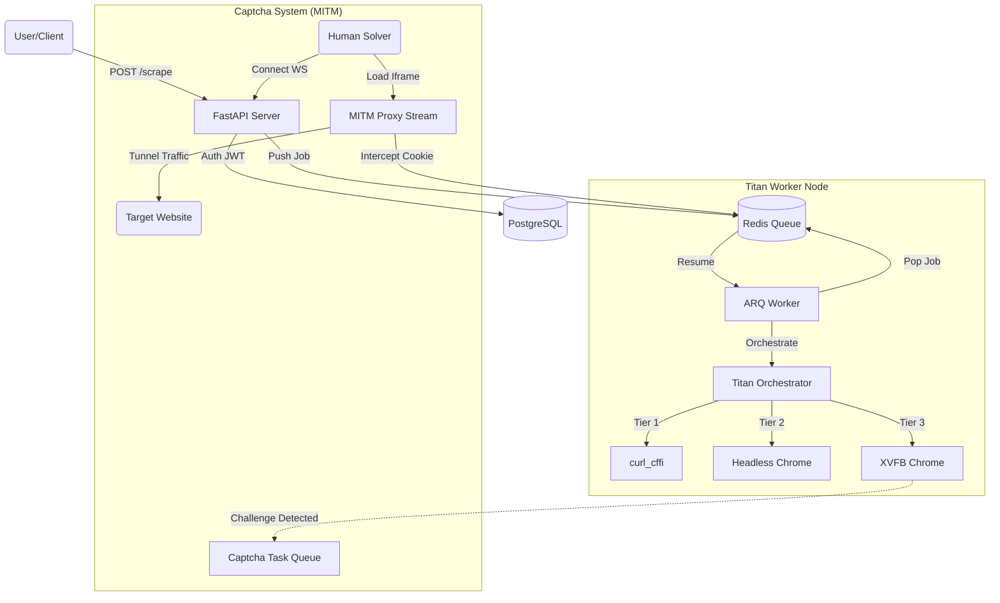
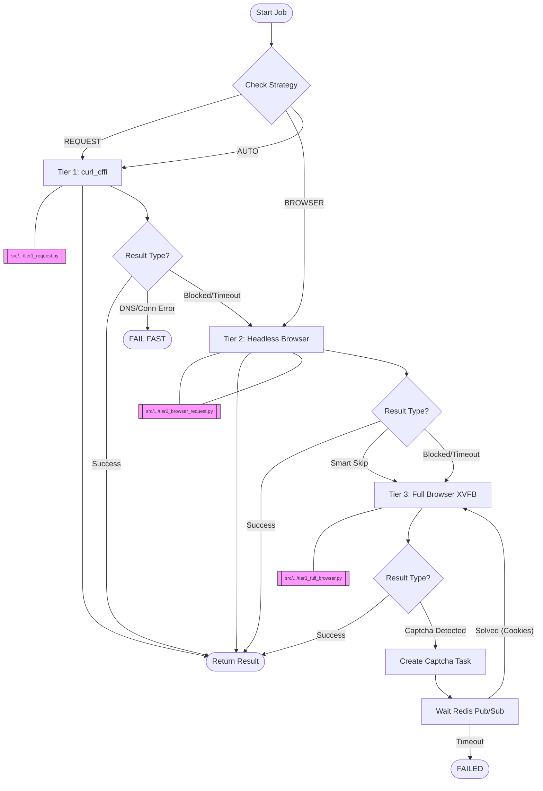

# 🦅 Titan Scraper Platform: Research-Grade Technical Insight

> **System Identity**: Enterprise-Grade Asynchronous Scraping Infrastructure
> **Core Architecture**: Distributed Worker Pattern (FastAPI + ARQ + Redis)
> **Key Capability**: "Smart Escalate" 3-Tier Hybrid Engine
> **Last Updated**: December 25, 2025

______________________________________________________________________

## 🏗️ 1. High-Level Architecture

The system operates as a **Scraping-as-a-Service** platform. It decouples the _request_ (API) from the _execution_ (Worker), allowing for high concurrency and resilience against slow browser operations.

### 📂 Project Structure

A breakdown of the key files and directories in the Titan Scraping Engine:

```text
├── docker/                     # Docker infrastructure configurations
│   ├── worker/                 # Worker-specific Docker setup
│   │   ├── Dockerfile          # Specialized image with Chromium & XVFB
│   │   └── start.sh            # Entrypoint triggering XVFB display
│   └── docker-compose.yml      # Orchestrates Services (API, Worker, Redis, DB)
│
├── src/
│   ├── app/
│   │   ├── api/v1/             # API Endpoints
│   │   │   ├── captcha.py      # Manual Solving API & Proxy Tunnel
│   │   │   ├── scraper.py      # Main Scrape Task Endpoints
│   │   │   ├── users.py        # RBAC User Management
│   │   │   └── ws.py           # WebSocket for Realtime Captcha Updates
│   │   │
│   │   ├── core/               # Core Infrastructure
│   │   │   ├── config.py       # Pydantic Settings (TitanSettings)
│   │   │   ├── security.py     # JWT Auth & Token Blacklisting
│   │   │   ├── worker/         # ARQ Worker Logic
│   │   │       └── functions.py# Worker Entrypoint (titan_execute)
│   │   │
│   │   ├── models/             # SQLAlchemy Database Models
│   │   │   ├── captcha.py      # CaptchaTask Model
│   │   │   ├── tier.py         # Subscription Tiers
│   │   │   └── user.py         # User Accounts
│   │   │
│   │   ├── services/titan/     # 🧠 THE TITAN ENGINE
│   │   │   ├── orchestrator.py # Logic: Smart Escalate (The Brain)
│   │   │   ├── engine.py       # Execution Interface
│   │   │   ├── browser.py      # Tier 2/3: Botasaurus Wrapper
│   │   │   ├── request.py      # Tier 1: curl_cffi Wrapper
│   │   │   └── session_cache.py# Redis Session Multiplexer
│   │   │
│   │   └── schemas/            # Pydantic Data Schemas
│   │       ├── scraper.py      # Scrape Request/Response Types
│   │       └── captcha.py      # Captcha Task Types
│   │
│   └── migrations/             # Alembic Database Migrations
│
├── scripts/
│   └── test_titan_e2e.py       # End-to-End Testing Suite
│
└── pyproject.toml              # Dependencies (curls-cffi, botasaurus)
```

```text
       +-------------+       +----------------+
       | User/Client | ----> | FastAPI Server |
       +-------------+       +-------+--------+
                                     |
                                     v
                            +----------------+
                            |  Redis Queue   |
                            +--------+-------+
                                     |
                                     v
+------------------------------------+----------------------------------+
|                        TITAN WORKER NODE                              |
|                                                                       |
|   +------------+         +--------------------+                       |
|   | ARQ Worker | ------> | Titan Orchestrator |                       |
|   +------------+         +---------+----------+                       |
|                                    |                                  |
|            +-----------------------+----------------------+           |
|            |                       |                      |           |
|            v                       v                      v           |
|   +----------------+      +------------------+    +-----------------+ |
|   |  Tier 1: curl  |      | Tier 2: Headless |    | Tier 3: Full    | |
|   +----------------+      +------------------+    +--------+--------+ |
|                                                            |          |
+------------------------------------------------------------|----------+
                                                             |
                                         (Challenge Detected)|
                                                             v
+------------------------------------------------------------+----------+
|                      CAPTCHA SYSTEM (MITM)                            |
|                                                                       |
|   +--------------+      +--------------+       +------------------+   |
|   | Human Solver | ---> |  MITM Proxy  | <===> |   Target Site    |   |
|   +------+-------+      +------+-------+       +------------------+   |
|          |                     |                                      |
|          v                     v                                      |
|     (WebSocket)        (Intercept Cookie)                             |
|                                |                                      |
|                                v                                      |
|                       +-----------------+                             |
|                       |   Redis Cache   |                             |
|                       +-----------------+                             |
+-----------------------------------------------------------------------+
```

<details>
<summary>📂 <strong>Click to expand/collapse diagram source code</strong></summary>



</details>

______________________________________________________________________

### 🔄 Data Flow & Logic Fallback Strategy

The specific decision tree used by `TitanOrchestrator.execute()`:

```text
[START] TitanOrchestrator.execute (src/app/services/titan/orchestrator.py)
   |
   | Input: url (str), options (ScrapeOptions), strategy (enum)
   v
[DECISION] Strategy Check
   |
   +-- {strategy: REQUEST} --> [Tier 1] Tier1RequestExecutor (tier1_request.py)
   |                               |
   |                               v
   |                        (TierResult)
   |                               |
   |                               +-- [STATE: SUCCESS] --> RETURN ScrapeResult
   |                               |
   |                               +-- [STATE: FAILED] ---> RETURN ScrapeResult (No Retry)
   |
   +-- {strategy: BROWSER} --> [Tier 2] Tier2BrowserRequestExecutor (tier2_browser_request.py)
   |                               |
   |                               v
   |                        (TierResult) [Success/Failed] -> RETURN
   |
   +-- {strategy: AUTO} (Default)
          |
          v
    [Tier 1] Tier1RequestExecutor (src/app/services/titan/tiers/tier1_request.py)
          | Data: curl_cffi Session (TLS Fingerprint)
          |
          +-- [STATE: SUCCESS] ----------------------------> RETURN ScrapeResult
          |
          +-- [STATE: ERROR] Check Error Type:
                  |
                  +-- {types: dns_error, connection_refused}
                  |       |
                  |       v
                  |   [FAIL FAST] -> RETURN FAILED (Orchestrator stops)
                  |
                  +-- {types: blocked, timeout, 403, 429}
                          |
                          v
                  [ESCALATION] -> Trigger Tier 2
                          |
                          v
    [Tier 2] Tier2BrowserRequestExecutor (src/app/services/titan/tiers/tier2_browser_request.py)
          | Data: Botasaurus Browser Session + driver.requests.get()
          |
          +-- [STATE: SUCCESS] ----------------------------> RETURN ScrapeResult
          |
          +-- [STATE: SKIP] "Smart Skip"
          |       | (Detected JS Challenge in < 500ms)
          |       v
          |   [SKIP TIER 2] -> Trigger Tier 3
          |
          +-- [STATE: BLOCKED] ----------------------------> Trigger Tier 3
                  |
                  v
    [Tier 3] Tier3FullBrowserExecutor (src/app/services/titan/tiers/tier3_full_browser.py)
          | Data: Full Chrome (XVFB) + Human Mode + Google Referrer
          |
          +-- [STATE: SUCCESS] ----------------------------> RETURN ScrapeResult
          |
          +-- [STATE: CAPTCHA] (Cloudflare Turnstile Detected)
                  |
                  v
          [ACTION] Create CaptchaTask (Redis/DB)
                  |
                  v
          [WAIT] Redis Pub/Sub (titan:task:{uuid})
                  |
                  +-- {event: SOLVED} --> [RETRY TIER 3] (With Cookies)
                  |
                  +-- {event: TIMEOUT} -> RETURN FAILED
```

<details>
<summary>📂 <strong>Click to expand/collapse mermaid logic source</strong></summary>



</details>

______________________________________________________________________

## 🧠 2. The "Titan" Engine (Core Logic)

**Location**: `src/app/services/titan/orchestrator.py`

The heart of this repo is the **Titan Orchestrator**, which implements an **Intelligent Multi-Tier Escalation Strategy**. It treats scraping optimization as a funnel to balance speed, cost, and stealth.

### 2.1 The 3 Tiers (Performance & Metrics)

Specific performance targets derived from `STAGE_1_TITAN_IMPLEMENTATION.md`:

| Tier       | Tech Stack              | Characteristics                                     | Bandwidth/Cost        | Ideal For                                                                                                          |
| :--------- | :---------------------- | :-------------------------------------------------- | :-------------------- | :----------------------------------------------------------------------------------------------------------------- |
| **Tier 1** | **`curl_cffi`**         | ⚡️ \<1s latency, TLS Fingerprint Spoofing (JA3/JA4) | **~50KB** (Low)       | API endpoints, unprotected HTML, JSON APIs                                                                         |
| **Tier 2** | **Headless Browser**    | 🐇 ~3-5s, JS Execution, **Bandwidth Saver**         | **~50KB** (Optimized) | Sites checking for "valid browser" but no severe WAF. Uses `driver.requests.get()` to fetch HTML _without_ assets. |
| **Tier 3** | **Full Browser (XVFB)** | 🐢 ~15-30s, "Human" mode, `google_get` bypass       | **~2MB** (High)       | Cloudflare Turnstile, DataDome, Akamai. Uses `google_get` trick (Google Cache referrer).                           |

### 2.2 Smart Logic Features

- **Fail-Fasting**: DNS errors (`nxdomain`) or Connection Refused errors trigger an immediate stop, preventing wasteful retries.
- **Smart Skip**: If Tier 1 detects a specific Cloudflare signatures (e.g., "Just a moment..."), the orchestrator **skips Tier 2** (which usually fails CF) and jumps straight to Tier 3.
- **Session Persistence**: Hashed "TinyProfiles" allow the worker to reuse cookies/localstorage across jobs for the same domain, reducing login/challenge frequency.

______________________________________________________________________

## 🚦 3. Manual Captcha Solving System (Deep Dive)

**Location**: `src/app/models/captcha.py` & `src/app/api/v1/captcha.py`

Unique to this repo is a **Human-in-the-Loop** subsystem for unblockable CAPTCHAs (like Turnstile). This is implemented as a **Man-in-the-Middle (MITM) Proxy**.

### 3.1 Architecture: The MITM Proxy Tunnel

Instead of just showing a screenshot, the system creates a live tunnel:

1. **Worker Blocked**: Tier 3 fails, creates `CaptchaTask`.
1. **Operator UI**: Loads an `<iframe>`.
1. **Proxy Endpoint**: `GET /api/v1/captcha/proxy/render/{task_id}` acts as the tunnel.
   - **Impersonation**: Uses `curl_cffi` to mimic the _exact_ TLS fingerprint of the worker.
   - **Header Stripping**: Removes `X-Frame-Options` and `Content-Security-Policy` from the upstream response to allow iframe embedding.
   - **Cookie Sniffing**: Inspects every `Set-Cookie` header. If `cf_clearance` is found, it's immediately cached in Redis.

### 3.2 Real-Time Communication (WebSocket)

- **Endpoint**: `/ws/captcha` (`src/app/api/v1/ws.py`)
- **Mechanism**: Redis Pub/Sub (`titan_events` channel).
- **Flow**: When the Proxy service detects a clearance cookie, it publishes `TASK_SOLVED`. The WebSocket pushes this to the frontend, which automatically closes the modal.

### 3.3 Redis Schema Strategy

| Key                      | Type          | Purpose                                                         |
| :----------------------- | :------------ | :-------------------------------------------------------------- |
| `titan:task:{uuid}`      | Hash          | Stores context (URL, Proxy, UA) for the active solver.          |
| `titan:session:{domain}` | String (JSON) | **The Holy Grail**. Contains valid `cf_clearance`. TTL: 1 hour. |
| `titan:lock:{uuid}`      | String        | Locks a task to a specific human operator.                      |

______________________________________________________________________

## 🛠️ 4. Engineering Challenges & Historical Context

This architecture evolved to solve specific "Deal-Breaker" bugs documented in `REFACTOR_STRATEGY.md` and `SUMMARY_CONVERSATION.md`.

### 4.1 The Infinite DNS Retry Bug

- **Problem**: Botasaurus's `@request` decorator had an internal retry loop (20s wait) that would spin forever on invalid domains (`NXDOMAIN`).
- **Fix**: Disabled internal retries (`max_retry=0`) and implemented a **Manual Retry Loop** in `tier1_request.py`. This loop specifically checks for DNS errors and "Fails Fast" (no retry) while allowing retries for network glitches.

### 4.2 The "False Success" (Medium.com)

- **Problem**: `driver.google_get()` would return `success=True` even if Cloudflare displayed a "Just a moment" challenge page, because HTTP status was 200.
- **Fix**: Implemented **Secondary Content Validation**. The worker now greps the HTML content for signatures like `cf-browser-verification` or `turnstile` _even after_ a "successful" load. If found, it marks the task as BLOCKED.
- **Refinement**: Initially, the keyword "blocked" was used for detection, leading to false positives on articles discussing "blocked chains" or "blocked pipes". This was refined to use **Strong Bot Patterns** only: `["bot detected", "unusual traffic", "verify you are human", "automated access"]`.

### 4.3 Browser Resource Exhaustion

- **Problem**: Chrome sessions consuming too much RAM, causing container OOM kills.
- **Fix**:
  - **Bandwidth Saver (Tier 2)**: Uses `block_images_and_css=True` to strip assets.
  - **Shared Memory**: Docker configured with `shm_size: 4gb` (increased from 2gb) to prevent `session deleted because of page crash`.
  - **Reduced Optimization**: Lowered `MAX_RETRIES` from 3 to 2, and reduced Tier 3 render sleep from 2s to 1s to improve throughput.

### 4.4 Advanced Status Mapping & Escalation Matrix

The system uses a strict mapping defined in `src/app/core/worker/functions.py` to decide when to escalate Tiers:

| Error Type      | Final Status | Escalation? | Reason                                                           |
| :-------------- | :----------- | :---------- | :--------------------------------------------------------------- |
| `blocked`       | **BLOCKED**  | ✅ Yes      | WAF/Anti-bot detection (403 + challenge).                        |
| `rate_limit`    | **BLOCKED**  | ✅ Yes      | HTTP 429. Different tier may have different rate limits/IPs.     |
| `server_error`  | **FAILED**   | ✅ Yes      | HTTP 5xx. Temporary server issue, worth a retry on higher tier.  |
| `dns_error`     | **FAILED**   | ❌ **No**   | Domain doesn't exist. No tier can fix this. **Fail Fast** logic. |
| `network_error` | **FAILED**   | ⚠️ Maybe    | Connection issues. Escalate if transient.                        |

______________________________________________________________________

## 🔐 5. Core Infrastructure & Security

### 5.1 Authentication & RBAC

- **JWT Implementation**: `src/app/core/security.py` handles access/refresh tokens.
- **Token Blacklist**: A Redis-backed blacklist ensures instant logout capabilities.
- **Role-Based Access**:
  - `User` model (`src/app/models/user.py`) has `tier_id` and `is_superuser`.
  - **Tiers** (`src/app/models/tier.py`) define rate limits, allowing monetization levels (e.g., "Free Tier" vs "Pro Tier").

### 5.2 Database (Async SQLAlchemy)

- **Session Mgmt**: `src/app/core/db/database.py` uses `async_sessionmaker`.
- **Migrations**: Uses Alembic for schema changes. _Note_: Recent migrations fixed Enum type creation idempotency using `DO $$ BEGIN ... EXCEPTION` blocks.

### 5.3 Worker Environment (Docker)

**Location**: `docker/worker/Dockerfile`
This is **critical** infrastructure and differs for the Titan worker.

- **XVFB**: Installs "X Virtual Framebuffer" to allow running "Headed" Chrome in a headless server environment.
- **Pinned Versions**: Chromium and Chromedriver are pinned to version `131.*`.
- **Self-Hosted Test Svc**: The `docker-compose.yml` includes a local `httpbin` service to prevent test flakiness from external API downtimes.

______________________________________________________________________

## 🚀 6. Developer Cheat Sheet

- **Running Locally**: Requires `docker-compose up -d redis db` (minimum).
- **Testing**: End-to-end tests are in `scripts/test_titan_e2e.py`.
  - Command: `python scripts/test_titan_e2e.py` (Must have worker running).
  - _Note_: Client polling timeouts were increased (60s -> 90s) to accommodate slower residential proxies.
- **Key Dependencies**:
  - `curl-cffi`: For TLS spoofing (Tier 1).
  - `botasaurus`: For browser automation (Tier 2/3).
  - `redis`: For Queues, Cache, and Pub/Sub.

______________________________________________________________________

## 🛠️ 7. Technology Stack & Tools Mapping

A detailed mapping of the technologies used, where they live in the codebase, and their specific purpose in the Titan architecture.

| Tech / Tool    | Implementation File(s)                                                                                          | Role & Purpose                                                                                                                                                                            |
| :------------- | :-------------------------------------------------------------------------------------------------------------- | :---------------------------------------------------------------------------------------------------------------------------------------------------------------------------------------- |
| **Botasaurus** | `src/app/services/titan/tiers/tier2_browser_request.py`<br>`src/app/services/titan/tiers/tier3_full_browser.py` | **Browser Automation & Anti-Detect**.<br>Used in Tier 2 for session/cookie management and Tier 3 for full rendering, Cloudflare bypass, and human simulation.                             |
| **curl_cffi**  | `src/app/services/titan/tiers/tier1_request.py`                                                                 | **TLS Fingerprint Spoofing**.<br>Used in Tier 1 to perform high-speed requests while impersonating browser TLS signatures (JA3/JA4) to avoid basic blocking.                              |
| **ARQ**        | `src/app/worker.py`                                                                                             | **Async Task Queue**.<br>Manages background scraping jobs, retries, and distributes work across worker nodes to handle high concurrency.                                                  |
| **Redis**      | `src/app/core/redis.py`                                                                                         | **Message Broker & Cache**.<br>Stores job queues (`arq:queue`), session/cookie data, and acts as the Pub/Sub channel for the real-time CAPTCHA system.                                    |
| **FastAPI**    | `src/app/main.py`<br>`src/app/api/`                                                                             | **API Server**.<br>High-performance async web framework handling incoming scrape requests, authentication, and WebSocket connections.                                                     |
| **XVFB**       | `docker/worker/Dockerfile`                                                                                      | **Virtual Display**.<br>Enables running "headful" Chrome (Tier 3) inside a headless Docker container, which is crucial for bypassing advanced bot detection that flags headless browsers. |
| **SQLAlchemy** | `src/app/models/`                                                                                               | **ORM (Database Layer)**.<br>Manages structured data storage (Users, Scrape History, API Keys) in PostgreSQL.                                                                             |

### 🦖 Botasaurus Integration Deep Dive

**Botasaurus** is the heavy-lifting engine for Tiers 2 and 3, selected for its advanced anti-detection capabilities compared to standard Selenium or Playwright.

#### 1. Location & Logic

It is isolated within the `src/app/services/titan/tiers/` directory to keep dependencies modular.

- **Tier 2 (Hybrid Mode)**: `tier2_browser_request.py`

  - **Technique**: Initializes a browser to pass initial challenges (like Cloudflare) and establish a "trusted" session.
  - **Optimization**: Uses `driver.requests.get()` to fetch **only the HTML** using the trusted browser session (cookies + fingerprint).
  - **Benefit**: Saves **97% bandwidth** and speeds up execution by 3-5x compared to full page loading, while maintaining high trust.

- **Tier 3 (Full Browser)**: `tier3_full_browser.py`

  - **Technique**: Uses `driver.google_get(url, bypass_cloudflare=True)` to navigate via Google search referrers, which often bypasses protections.
  - **Human Simulation**: Calls `driver.enable_human_mode()` to inject real-time mouse movements, scrolling, and typing delays, making the bot indistinguishable from a real user.
  - **Purpose**: The "Nuclear Option" for the most stubborn sites that require full JavaScript execution and behavioral analysis.
